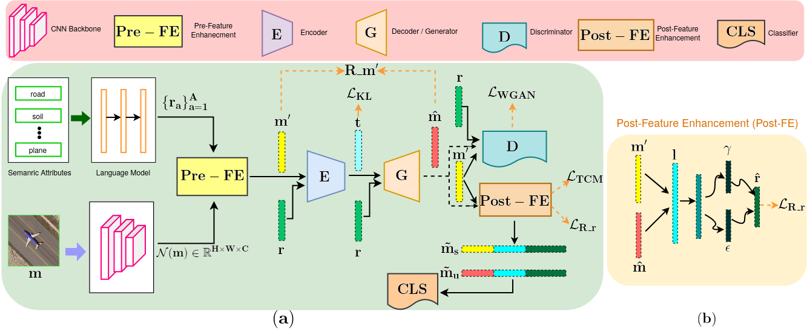

**Zero-ViFERS**


This GitHub repository contains the training code for the paper  "**Zero-ViFERS: Visual Feature Enhancement for Zero-Shot Scene Classification in Remote Sensing Images**". 

This paper mainly focuses on creating semantic attributes for the four prominent remote sensing benchmark datasets (i.e., UCM21, AID30, NWPU-RESISC45, and WHU-RS19). For each class, we identified the objects that differentiate it from all the other classes, and some common attributes in various classes were also considered. For the UCM21, AID30, NWPU-RESISC45, and WHU-RS19 datasets, we have created 33, 44, 57, and 26 semantic attributes, respectively. These semantic attributes and attribute over values are available at ./data/xlsa17/code/...

**The Framework for the Zero-ViFERS**



**Dependencies to run the Zero-ViFERS**

The implementation of "Zero-ViFERS" is based on Python 3.8.8 and [PyTorch](https://pytorch.org/) 1.8.0. To install all required dependencies:
```
$ pip install -r requirements.txt
```
Furthermore, we use [Weights & Biases](https://wandb.ai/site) (W&B) to do experiments. However, in this training code, we set the wandb mode="disabled" for the sake of user-friendly. Just install wandb: 
```
$ pip install wandb
```
**Optional:** To keep track and organize the results of experiments, set the wandb mode="online". You may need to follow the [online documentation](https://docs.wandb.ai/quickstart) of W&B to start quickly. To run these codes, [sign up](https://app.wandb.ai/login?signup=true) an online account to track experiments or create a [local wandb server](https://hub.docker.com/r/wandb/local) using docker (recommended).

**Downloading datasets**

We trained the model "Zero-ViFERS" on four prominent benchmark datasets of the zero-shot scene classification in remote sensing images: [UCM21](http://weegee.vision.ucmerced.edu/datasets/landuse.html), [AID30](https://captain-whu.github.io/AID/), NWPU-RESISC45, and WHU-RS19. Please download NWPU and WHU-RS19 datasets in your way. To train the "Zero-ViFERS", first, you should download these datasets. Then, decompress and organize them as follows: 
```
.
├── data
│   ├── UCM/...
│   ├── AID/...
│   ├── NWPU/...
│   └── RSD/...
└── ···
```
Specifically, the samples of the UCM dataset are organized as follows: 
```
├── data
│   ├── UCM/runway/runway89.tif
|   |__ UCM/river/river35.tif
|   |__ UCM/sparseresidential/sparseresidential25.tif
│   |__ ...
└── ···
```
**Obtaining res101.mat and att_splits.mat files**

Please follow the instructions below to obtain res101.mat and att_splits.mat files, and place them in Zero-ViFERS/data/xlsa17/data/{dataset}/... 

Run the following codes one after the other.
```
$ cd data/xlsa17/code
```
```
$ python mataw.py
```
First of all, set the dataset path and run the mataw.py file. This code will generate {dataset}_img.csv and {dataset}_label.csv files.

```
>> mat_create 
```
This Matlab file creates res101.mat file with the help of {dataset}_img.csv and {dataset}_label.csv.

```
$ python dataset_create.py
```
Initially, set the dataset path and run the dataset_create.py file. This code obtains att_splits.mat file. 

Then, place **res101.mat** and **att_splits.mat** files into Zero-ViFERS/data/xlsa17/data/{dataset}/...

Example for the UCM dataset: 
```
          Zero-ViFERS/data/xlsa17/data/UCM/res101.mat    
          Zero-ViFERS/data/xlsa17/data/UCM/att_splits.mat
```
**Extracting visual features**

Run the specified commands to extract the visual features of four datasets:

```
$ python preprocessing.py --dataset UCM --compression --device cuda:0 
$ python preprocessing.py --dataset AID --compression --device cuda:0
$ python preprocessing.py --dataset NWPU --compression --device cuda:0
$ python preprocessing.py --dataset RSD --compression --device cuda:0

Note: Adjust the "split_idx" value in the preprocessing.py file according to the dataset path if you get FileNotFoundError while running the above code.
```

**Training Zero-ViFERS**

In `./wandb_config`, we provide the parameters setting of conventional zero-shot learning (CZSL) and generalized zero-shot learning (GZSL) tasks for UCM21, AID30, NWPU-RESISC45, and WHU-RS19. 
Run the given commands to train the "Zero-ViFERS" from scratch:

```
$ python train_ucm.py   # UCM
$ python train_aid.py   # AID
$ python train_nwpu.py  # NWPU
$ python train_rsd.py  # RSD
```
